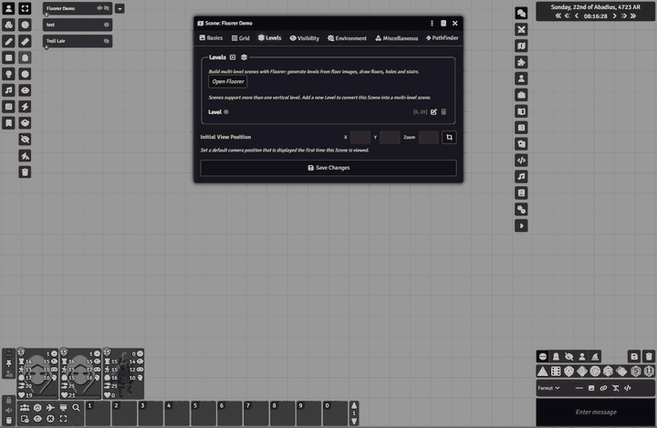

# Floorer



Guided builder for Foundry VTT v14 multi-level scenes. GM only.

## Workflow

1. Open a scene and click the **Floorer** button in the Regions control group.
2. **Set up levels**: choose floors above ground, basements, an optional roof, floor height and ground elevation. The band preview updates live; pick one background image per level. If the scene still has only the untouched default level, Floorer adopts it as the ground floor.
3. Click a level's caret or name to view it. In the active row draw its **footprint** (polygon, rectangle or the whole scene). Floorer creates a Define Surface region in the level's band, marks the top inclusive and tags the surface to every level that can see it, so floors never look transparent.
4. **Hole** cuts an opening in the active floor and mirrors it into the ceiling of the level below.
5. **Stair**: pick the target level (defaults to the level above) and draw. Floorer places a Change Level region in the lower band, tags both levels and mirrors the opening into both surfaces.
6. While the panel is open, **Dim other floors** fades placeables that belong to other levels, and new walls, tiles, sounds and notes are tagged to the active level. Lights get elevation only so light spills through openings.

Problems are listed under the level they belong to; **Fix** or **Fix all** repairs them. **Undo** and **Revert** reverse Floorer's changes for the current scene view.

## Settings

- Mirror holes into the level below
- Auto-tag new placeables to the active level
- Seal basements by default

## Development

```
npm install
npx jest
npx eslint .
```
